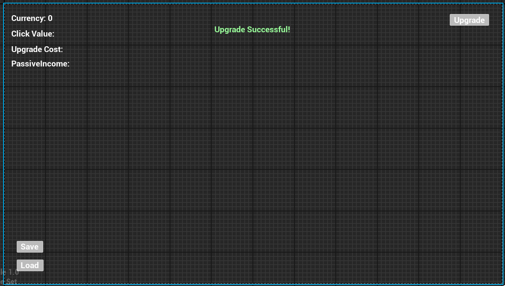

# UI System Spec (Design)
## 1. 목적
- UI 시스템의 구조, 위젯 풀링 정책, 이벤트 흐름을 문서화
- 새로운 위젯 추가 시 일관성을 유지하기 위한 가이드라인 제공.

## 2. HUD Layout
- 위젯 위치: Content/Widgets/WBP_ClickerUI
- 주요 위젯: 
  - CurrencyText
  - ClickValueText
  - UpgradeCostText
  - PassiveInconeText
  - UpgradeSuccessText
  - UpgradeButton
  - SaveButton
  - LoadButton
- 배치:
  - 1. 재화관련 텍스트: 좌상단에 위치.
  - 2. Save/Load 버튼: 좌하단에 위치
  - 3. 업그레이드 버튼: 우상단에 위치
  - 4. 업그레이드 성공 텍스트: 상단 중앙에 위치
- 사진:

## 3. Floating Text 
- 위젯 위치: Content/Widgets/WBP_ClickFloatingText
- 위젯 요소:
  - RewardText
- 배치:
  - 화면 정 중앙
- 색:
  - Yellow
- 애니메이션:
  1. ToastAnim

## 4. Idle Reward Text
- 위젯 위치: Content/Widgets/WBP_IdleRewardText
- 위젯 요소:
  - RewardText
- Location:
  - 소스코드에서 랜덤 위치로 제어
- Color:
  - Green
- Animation:
  - ToastAnim
## 5. Widget Pool Policy
- HUD / Idle / FloatingText Widgets:
  - 초기 1회만 AddToViewport
  - 이후 Visible/Collapsed 토글로 사용
  - 애니메이션 종료 후 Collapsed
- 생성 지점 및 반납 루틴:
  - HUDWidget
    - 생성: UISubsystem.ShowHUD()
    - 반납: - 
  - IdleRewardText
    - 생성: UISubsystem::GetWidgetFromPool()
    - 반납: UToastWidgetBase::PlayToast()->UToastWidgetBase::OnToastFinished()->Collapsed
  - FloatingText
    - 생성: UISubsystem::GetWidgetFromPool()
    - 반납: UToastWidgetBase::PlayToast()->UToastWidgetBase::OnToastFinished()->Collapsed

## 6. Event Flow
- Currency Acquisition:
  1. EconomySubsystem::OnEconomyChanged 
  - -> UISubsystem::AddUniqueDynamic(OnEconomyChanged) 
  - -> EconomySubsystem::Broadcast()
  - -> OnEconomyChanged::Broadcast()
  - -> UISubsystem::OnEconomyChanged()
  - -> UISubsystem::UpdateScore()
- Click:
  1. PlayerController::BindKey(LeftClick, PlayerController.OnClick)
  - -> EconomySubsystem::OnClicked()
  - -> EconomymSnapshot.Currency ++
  - -> EconomySubsystem::Broadcast()
  1. UISubsystem::ShowClickEffect()
  2. UISubsystem::ShowFlotingText()
- Upgrade:
  - UISubsystem::UpgradeButton->AddDynamic(PlayerController.OnUpgradeClicked)
  - PlayerController::OnUpgradeClicked()
  - -> EconomySubsystem::TryUpgrade()
  - -> EconomySubsystem::Broadcast()
- Save:
  1. UISubsystem::SaveButtton->AddDynamic(PlayerController::OnSaveClicked)
  - -> PlayerController::OnSaveClicked()
  - -> EconomySubsystem::RequestSave()
  - -> SaveManagerSubsystem::SaveProgress(FEconomySnapshot)
  - -> UGameplayStatics::SaveGameToSlot(SaveDataContainer, SlotName, Index)
- Load:
  1. UISubsystem::LoadButtton->AddDynamic(PlayerController::OnLoadClicked)
  - -> PlayerController::OnLoadClicked() 
  - -> EconomySubsystem::RequestLoad()
  - -> SaveManagerSubsystem::LoadProgress(FEconomySnapshot)
  - -> UGameplayStatics::LoadGameFromSlot(SlotName, Index)
  - -> Cast<SaveDataContainer>(LoadData) => FEconomySnapshot
  - -> EconomySubsystem::UpdateLastOfflineReward(FEconomySnapshot)
  - -> EconomySubsystem::TriggerOfflineReward()
  - -> EconomySubsystem::ApplySnapshot(FEconomySnapshot)
  - -> EconomySubsystem::RequestSave()
- 1Tick Idle Reward
  - 
- Offline Reward
- UISettings DataAsset Connection/Disconnection
  - Connection:
    - UISubsystem::Initialize()
  - Disconnection:
    -  UISubsystem.Deinitialize()

## 7. Data Asset
- UISettings(Primary Data Asset)
  - 멤버:
    1. UI
       - HUD Widget Class: 메인 HUD 위젯(WBP_ClickerUI)
       - Floating Text Widget Class: Floating Text 위젯 클래스(WBP_ClickFloatingText)
       - Idle Reward Text Widget Class: Idle Reward 위젯 클래스(WBP_IdleRewardText)
    2. FX
       - Click Effect Asset: 클릭 FX(NS_ClickEffect)
    3. Sound 
       - Click Reward Sound: 클릭 보상 사운드
       - Offline Reward Sound: 오프라인 보상 사운드
